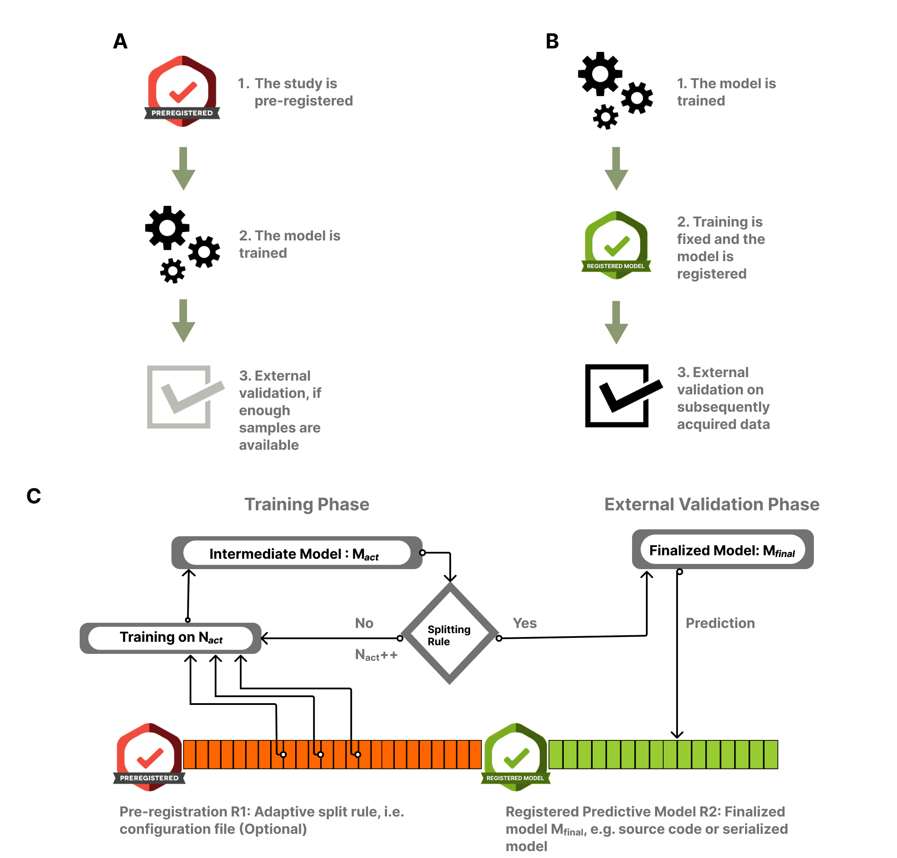

AdaptiveSplit
==========================
A Scikit-Learn compatible Adaptive training-validation split during prospective 
data acquisition to improve the development and external validation of predictive
models.

#### Scikit-Learn example usage:
    
    from adaptivesplit.sklearn_interface.split import AdaptiveSplit
    
    X = "your predictors here"
    y = "your target here"
    
    model = "an sklearn estimator"
  
    adsplit = AdaptiveSplit(total_sample_size=len(y), plotting=True)
    res, fig = adsplit(X, y, model, fast_mode=True, predict=False, random_state=42)
    stop = res.estimated_stop

This prints out the results and plots the learning and power curves.

- An extended, working example can be found in ["our example notebook"](notebooks/example.ipynb)
- A description of possible warnings frequently encountered during runtime can be found in ["our warnings notebook"](notebooks/warnings.ipynb)

## Documentation
The package documentation is available [here](https://pni-lab.github.io/adaptivesplit/).

## Installation
The package can be installed in two simple commands:

    # install the main package;
    pip install git+https://github.com/pni-lab/adaptivesplit

    # install regressors as a dependency;
    pip install git+https://github.com/gallg/regressors

If you don't want to utilize the package with default parameters, but you want to customize your stopping
rule, please clone the repository without installing adaptivesplit as a package. **Remember to install regressors
as a dependency**.

    # clone the repository;
    git clone https://github.com/pni-lab/adaptivesplit

cloning the repository allows easy access to the ["configuration file"](adaptivesplit/settings.conf) used to
easily modify the stopping rule criteria. Once the repo is cloned you can immediately start using adaptivesplit with
["our example notebook"](notebooks/example.ipynb)

## Concept
You can find an extensive illustration of the concept behind the AdaptiveSplit package in our preprint 
[here](https://www.biorxiv.org/content/10.1101/2023.12.01.569626v1). The paper also describes why AdaptiveSplit is preferable 
to a fixed data splitting strategy (e.g pareto split).

The concept, in short, is shown by the image below:

*The "adaptive splitting design" for prospective predictive modeling studies:
(A) show a normal study pre-registration, the model with its parameters is first
pre-registered, then trained and validated. (B) With AdaptiveSplit, the model is
trained to fix its parameters and the training sample size, then it is registered
and subsequently acquired data is used for external validation.*

#### Phases of a prospective study with AdaptiveSplit:
- The study starts by pre-registering the stopping rule (C),
- During the training phase, candidate models are trained and the splitting rule
  is repeatedly evaluated, as the data acquisition proceeds (R1)
- When the splitting rule activates, the model is finalized using the training samples (R2)
- Finally, data acquisition continues and the prospective external validation is performed 
  on the newly acquired data.
